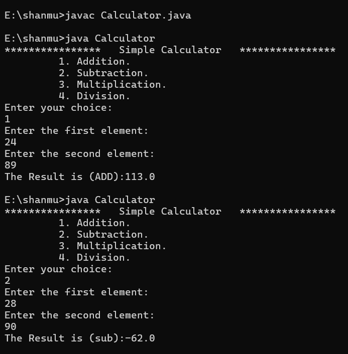

**Project Title: Simple Calculator (Java)**

This is a basic console-based **" Simple Calculator "** written in Java.  

It allows the user to perform simple arithmetic operations like:  

&nbsp;    1. Addition

&nbsp;    2. Subtraction

&nbsp;    3. Multiplication

&nbsp;    4. Division

**Features:**

1. &nbsp;Displays a menu with 4 operations:

&nbsp;   \* Addition

&nbsp;   \* Subtraction

&nbsp;   \* Multiplication

&nbsp;   \* Division

2\.  Prompts the user to:

&nbsp;    \* Select an operation by entering a number (1–4).

&nbsp;    \* Input two numbers to perform the calculation.

&nbsp;    \* Uses a "switch" statement to perform the chosen operation.

&nbsp;    \* Handles **" division by zero "** with an error message.

&nbsp;    \* Displays the result of the operation.

&nbsp;    \* Handles invalid menu choices.

**How It Works:**

1\. The program uses:

&nbsp;   \* Scanner → to read user input.

&nbsp;   \* switch-case → to select and perform the operation.

2\. Steps:

&nbsp;    \* Display the calculator menu.

&nbsp;    \* Read the user’s choice.

&nbsp;    \* If the choice is valid (1–4), read two numbers.

&nbsp;    \* Perform the selected operation:

&nbsp;    \* Addition → value1 + value2

&nbsp;    \* Subtraction → value1 - value2

&nbsp;    \* Multiplication → value1 \* value2

&nbsp;    \* Division → value1 / value2 (with zero-check)

3\.  Print the result or error message.

4\.  If the choice is invalid, display **"Invalid Input!".**

**How to Run:**

1\. Save the code as **"Calculator.java".**

2\. Compile the program:

&nbsp;                     **javac Calculator.java**

Run the program:

&nbsp;              **java Calculator**

**SampleOutput:**

Here is a screenshot of the program's output:

 

